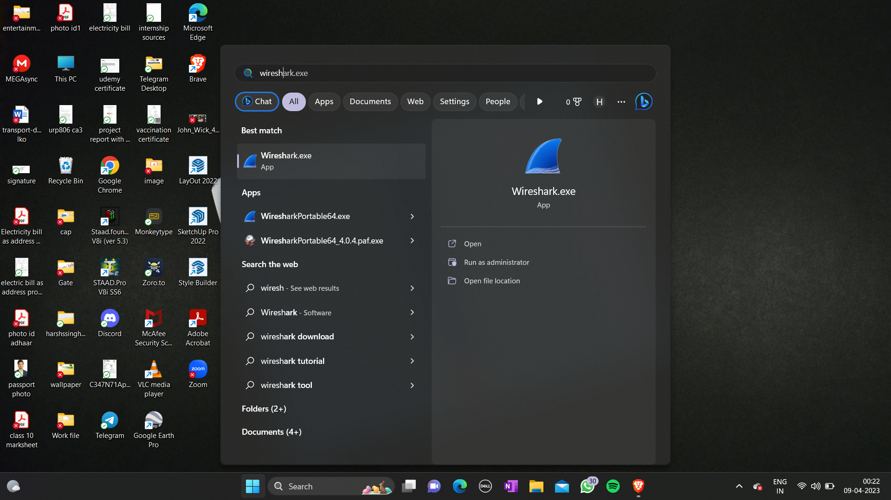

# INT301
Open Source Project

### Question
<h2><b>Implement a network miner tool to detect the operating system, sessions and open ports through
packet sniffing and investigate the network traffic.</b></h2>
___

<h3>In this project, I will be implementing a network miner tool using Wireshark to detect the operating system, sessions, and open ports through packet sniffing and investigating network traffic. Wireshark is a popular open-source packet analyzer that allows us to capture and analyze network traffic in real-time. With Wireshark, I will be able to monitor and analyze the packets flowing through the network and gain valuable insights into the devices, protocols, and services being used.

To detect the operating system, I will be using Wireshark's built-in functionality to analyze the packets and identify the operating system being used by each device on the network. This will involve analyzing the various network protocols and fingerprinting techniques to determine the specific operating system version and vendor.

To detect sessions, I will be using Wireshark to capture and analyze the various network sessions taking place on the network. This will involve analyzing the various network protocols such as TCP, UDP, and ICMP to identify the start and end of each session, the data being transmitted, and the devices involved in the session.

To detect open ports, I will be using Wireshark to capture and analyze the various network packets to identify the ports that are being used by various devices on the network. This will involve analyzing the various network protocols such as TCP, UDP, and ICMP to identify the ports that are being used by different services and applications.

Overall, the project will involve using Wireshark to capture and analyze network traffic in real-time and gain valuable insights into the devices, protocols, and services being used on the network. By implementing this network miner tool, we will be able to detect the operating system, sessions, and open ports through packet sniffing and investigate the network traffic.</h3>

___
<h3>Finding the operating system</h3>

To find the operating system using the Time to Live (TTL) in Wireshark, you can follow these step-by-step procedures:

Start Wireshark: Open Wireshark on your computer.

Capture network traffic: Capture the network traffic you want to analyze by selecting the appropriate network interface in Wireshark.

Filter packets: Apply a filter to the captured packets to reduce the amount of data you need to analyze. To filter the packets by the TTL field, use the following filter expression: "ip.ttl==128". This will show all packets with a TTL of 128, which are commonly used by certain operating systems.

Observe TTL values: Examine the TTL values of the packets that are displayed in the capture window. The TTL values are displayed in the Time to Live column.

Determine the operating system: Compare the TTL values of the packets to the TTL values of known operating systems. Different operating systems use different TTL values, so by comparing the TTL values of the packets to known values, you can determine the operating system.

Repeat for other packets: Repeat this process for other packets to get a better idea of the operating systems being used on the network.

By following these steps, you can use Wireshark to determine the operating system being used on a network by analyzing the TTL values of the captured packets.

